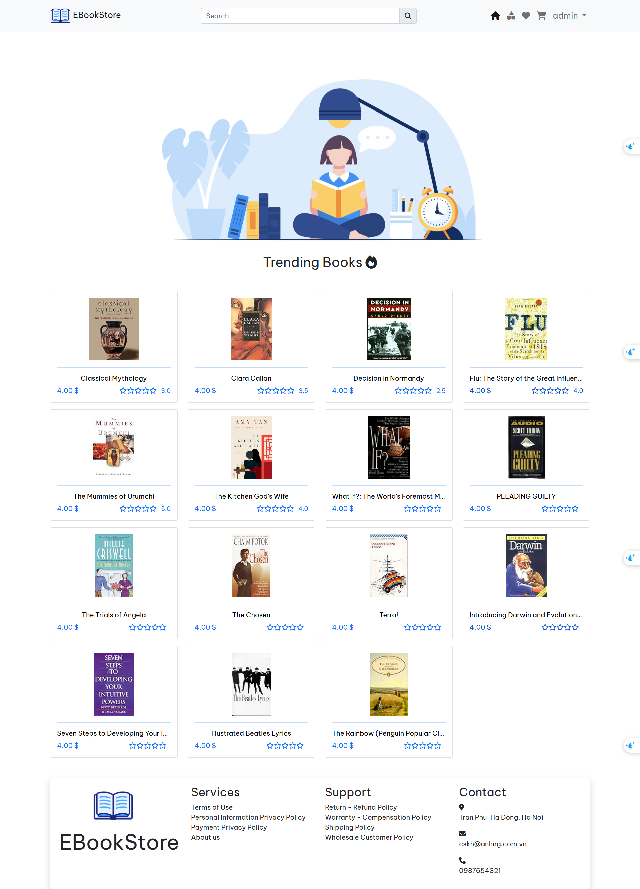
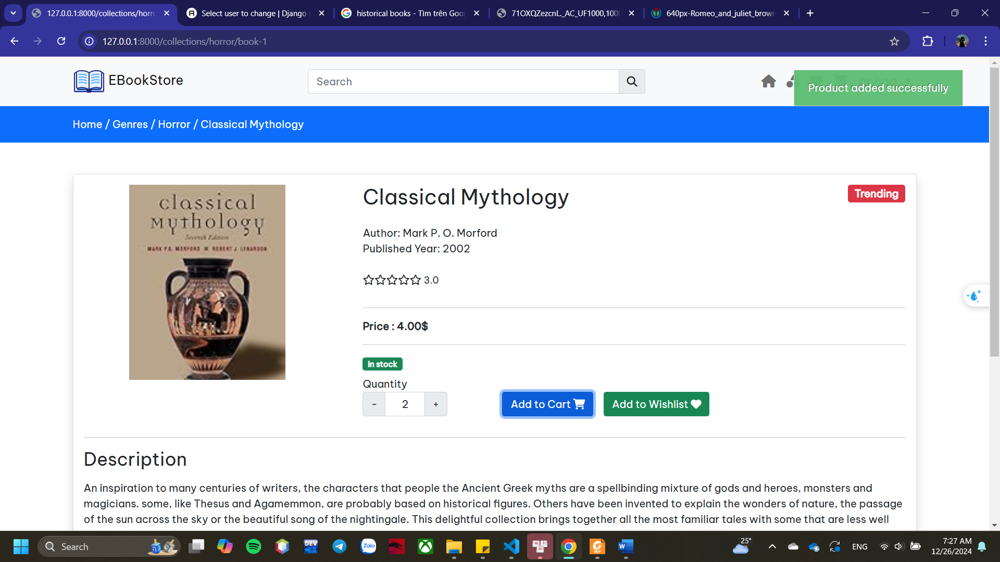
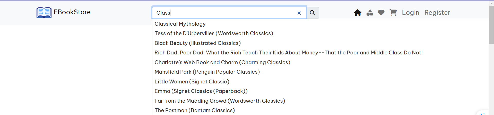
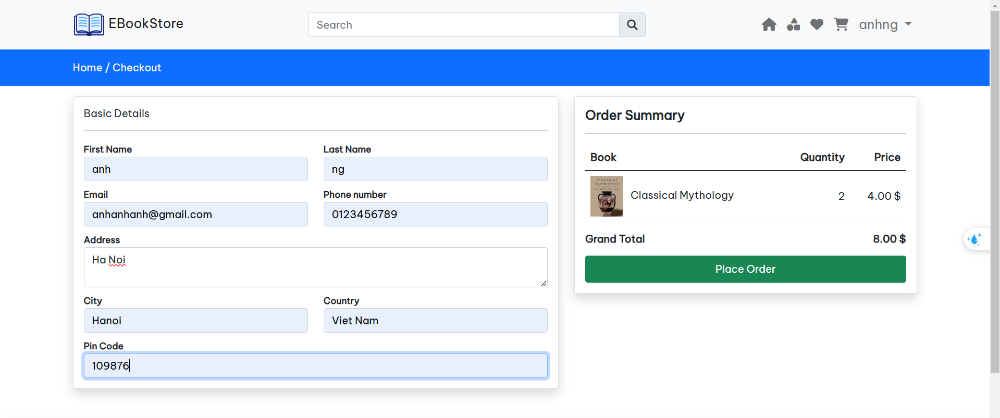
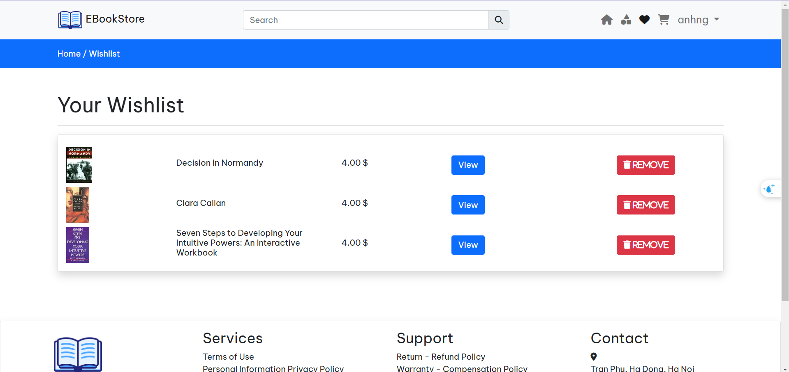
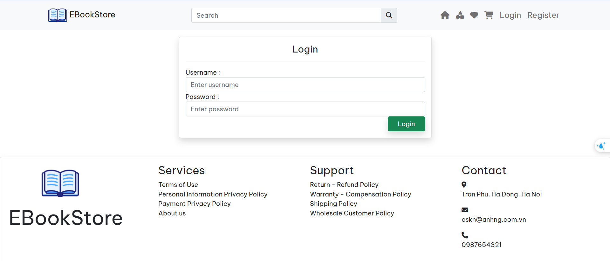
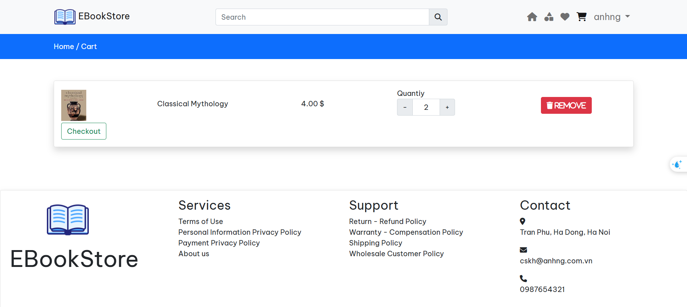
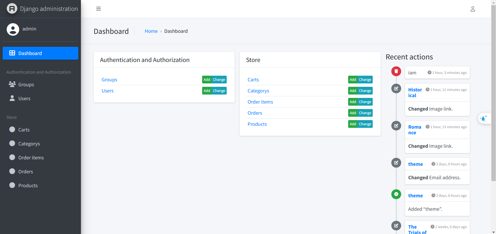

# 📚 EBookstore — Online Bookstore Web Application

> An e-commerce web application for browsing and purchasing books online, built with Django and a custom-designed frontend.

---

## 📸 Screenshots

| Home Page | Book Detail | Search Results |
|-----------|-------------|----------------|
|  |  |  |

| Checkout Page | Wishlist |
|---------------|----------|
|  |  |

| Login Page | Cart | Admin Dashboard |
|------------|------|-----------------|
|  |  |  |

---

## ✨ Features

- 🔐 **User Authentication** — Register, login and logout functionality
- 📖 **Book Catalog** — Browse all available books with cover images and details
- 🔍 **Search & Filter** — Search books by title or category
- 📄 **Book Detail Page** — View full description, price and availability
- 🛒 **Shopping Cart** — Add/remove books and manage cart items
- 💳 **Checkout Page** — Payment information form with input fields and order summary UI *(UI only — payment gateway not integrated)*
- ❤️ **Wishlist** — Save favourite books to a personal wishlist for later
- 🛠️ **Admin Panel** — Manage books, users and orders via Django Jazzmin dashboard

---

## 🛠️ Tech Stack

### Frontend
| Technology | Usage |
|------------|-------|
| HTML5 | Page structure and semantic markup |
| CSS3 | Custom styling, layout, responsive design |
| JavaScript | Dynamic interactions (login, cart updates, etc.) |
| jQuery | DOM manipulation and AJAX requests |
| Bootstrap | UI components and grid system |

### Backend
| Technology | Usage |
|------------|-------|
| Python 3 | Core programming language |
| Django | Web framework (MVC architecture) |
| Django Jazzmin | Admin dashboard UI |
| MySQL | Relational database for storing book/user data |

---

## 🗂️ Project Structure

```
ebookstore-prj/
│
├── ebookstore/                  # Django project settings
│   ├── settings.py
│   ├── urls.py
│   └── wsgi.py
│
├── store/                       # Main application
│   ├── controller/              # View logic separated by feature
│   │   ├── authview.py          # Login / Register
│   │   ├── cart.py              # Cart interactions
│   │   ├── checkout.py          # Checkout form
│   │   └── wishlist.py          # Wishlist feature
│   ├── migrations/              # Database migrations
│   ├── templates/store/
│   │   ├── auth/
│   │   │   ├── login.html
│   │   │   └── register.html
│   │   ├── inc/
│   │   │   ├── navbar.html      # Custom navigation bar
│   │   │   ├── footer.html
│   │   │   └── slider.html
│   │   ├── layouts/
│   │   │   └── main.html        # Base template
│   │   ├── products/
│   │   │   ├── index.html       # Book catalog
│   │   │   └── view.html        # Book detail page
│   │   ├── cart.html
│   │   ├── checkout.html        # Checkout form UI
│   │   ├── collections.html
│   │   └── wishlist.html
│   ├── static/
│   │   ├── css/
│   │   │   └── custom.css       # Custom styles
│   │   └── js/
│   │       ├── custom.js        # Custom JS interactions
│   │       └── jquery-3.7.1.min.js
│   ├── models.py
│   ├── views.py
│   ├── urls.py
│   ├── forms.py
│   └── admin.py
│
├── screenshots/                 # UI screenshots for README
├── demo.mp4                     # Project demo video
├── requirements.txt
├── manage.py
└── README.md
```

---

## ⚙️ Installation & Setup

### Prerequisites
- Python 3.x
- MySQL Server
- pip

### Steps

```bash
# 1. Clone the repository
git clone https://github.com/Tlemonesis/ebookstore-prj.git
cd ebookstore-prj

# 2. Install dependencies
pip install -r requirements.txt

# 3. Configure your database in settings.py
DATABASES = {
    'default': {
        'ENGINE': 'django.db.backends.mysql',
        'NAME': 'db_name',
        'USER': 'mysql_user',
        'PASSWORD': 'password',
        'HOST': 'localhost',
        'PORT': '3306',
    }
}

# 4. Run migrations
python manage.py migrate

# 5. Create superuser (for admin access)
python manage.py createsuperuser

# 6. Start development server
python manage.py runserver
```

Visit: `http://127.0.0.1:8000`

---

## 💡 What I Built & Learned

This project was developed as a **small academic assignment** to practice building a web application. While modest in scale, it reflects my hands-on approach to learning web development — from designing UI layouts to connecting a live database.

**Key personal contributions:**
- Designed and coded HTML/CSS templates with a custom visual style
- Implemented interactive features (login flow, cart interactions) using JavaScript and jQuery by studying and adapting patterns from online resources
- Built a checkout form UI with structured input fields (name, address, payment info) and order summary layout
- Implemented a wishlist feature allowing users to save and manage favourite books
- Integrated Django Jazzmin for a modern admin experience
- Connected and managed a real MySQL database with book data

---

## 📬 Contact

**[Nguyen Trang Anh]**
📧 anhtrang292002@gmail.com
🐙 [GitHub](https://github.com/Tlemonesis)
